[TOC]

## Exercise 0.1

- **一些基本命令**

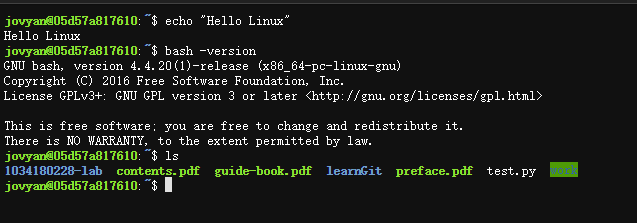

## Exercise 0.2

- **重定向`>`**

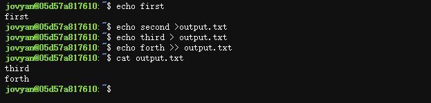

## Exercise 0.3

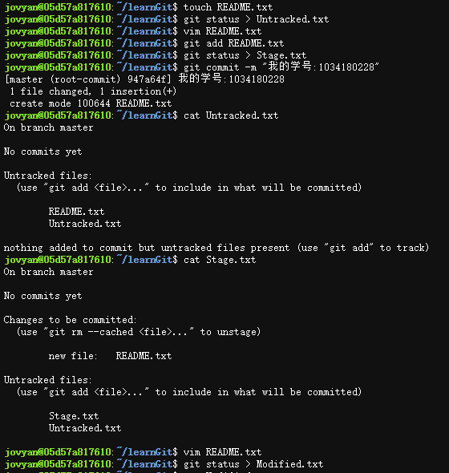

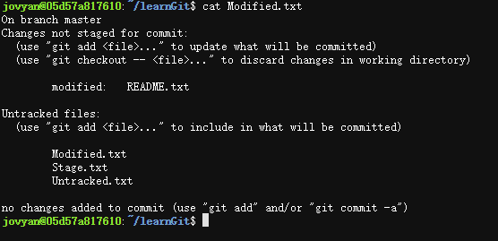

## Exercise 0.4

- `git reset`

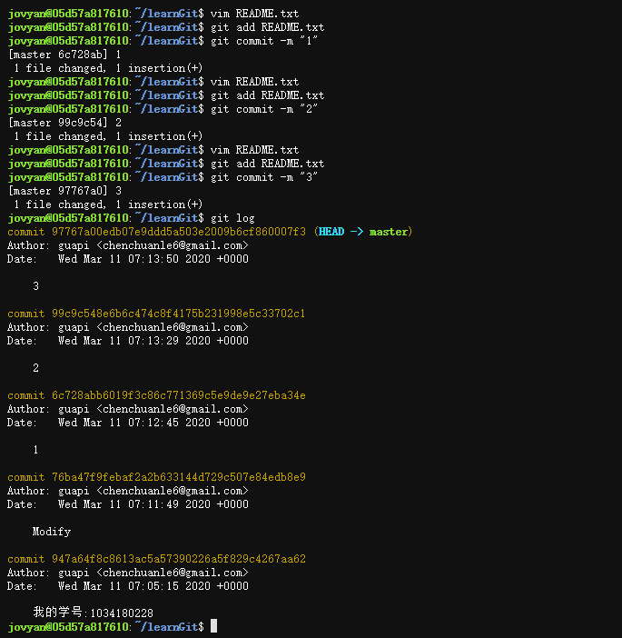

## Exercise 0.5

- `git branch`

## Exercise 0.6

- `Makefile`

​	

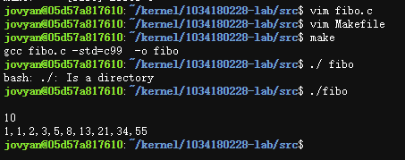

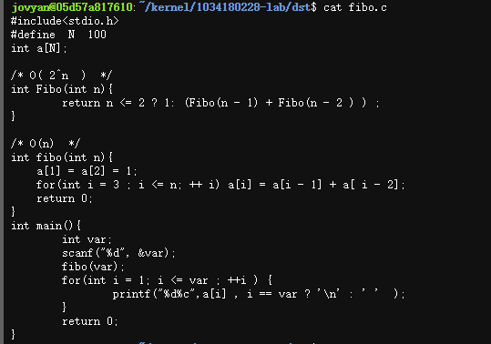

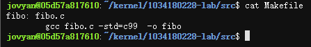

- **`sed` 命令**

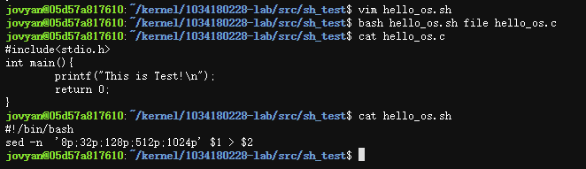

- **`cp` 复制**

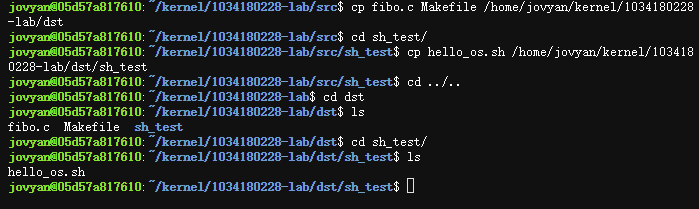

- **运行结果**

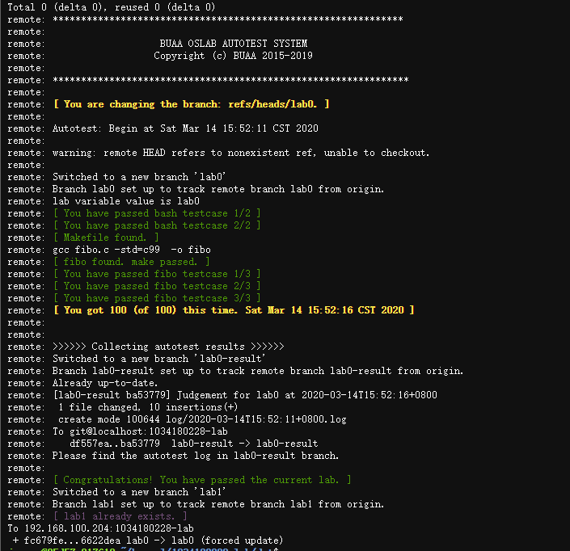