# 操作系统实验Lab1


## Exercise 1.1

- **修改交叉编译路径为 `/OSLAB/compiler/usr/bin/mips_4KC-`**

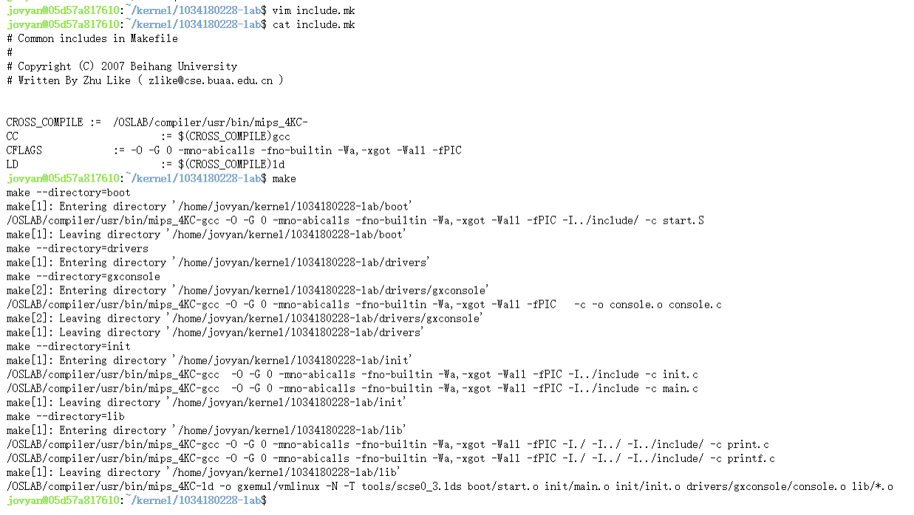


- **`gxemul/` 目录下生成`vmlinux` 内核文件**


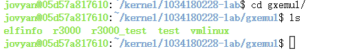


## Exercise 1.2

### 补全 `readelf.c` 文件

- **方法1**

```c
// get section table addr, section header number and section header size.
shdr = (Elf32_Shdr *)(binary + ehdr -> e_shoff); //section table addr
sh_entry_count = ehdr -> e_shnum; //section header number
sh_entry_size = ehdr -> e_shentsize; //section header size
// for each section header, output section number and section addr.
for(Nr = 0; Nr < sh_entry_count; ++ Nr)
{
    printf("%d:0x%x\n" , Nr , shdr->sh_addr);
    shdr ++ ;
}
```


- **方法2**

```c
// get section table addr, section header number and section header size.
ptr_sh_table = binary + ehdr -> e_shoff;
sh_entry_count = ehdr -> e_shnum; //section header number
sh_entry_size = ehdr -> e_shentsize; //section header size
// for each section header, output section number and section addr.
for(Nr = 0; Nr < sh_entry_count; ++ Nr)
{
    shdr = (Elf32_Shdr *)(ptr_sh_table);
    printf("%d:0x%x\n" , Nr , shdr->sh_addr);
    ptr_sh_table += sh_entry_size;
}
```


### 解析 testELF 文件

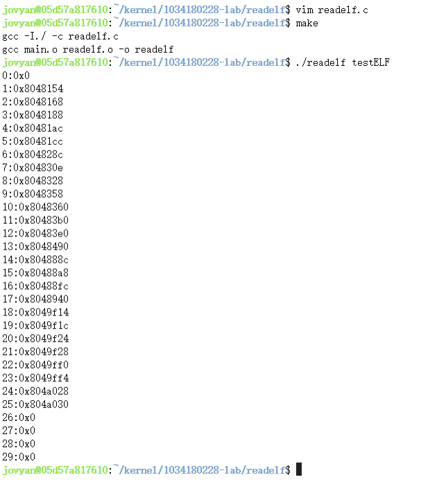

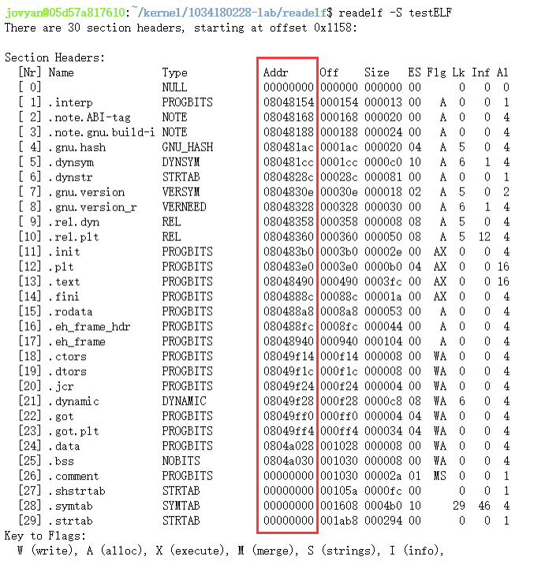


## Exercise 1.3

### 补全 tools/scse_03.lds

- **将起始地址设为 `0x80010000`**

```asm
SECTIONS
{
  . = 0x80010000;
  .text : { *(.text) }
  .data : { *(.data) }
  .bss : { *(.bss) }
end = . ;
}
```


### 查看地址

- **重新`make`，生成`vmlinux`内核文件**

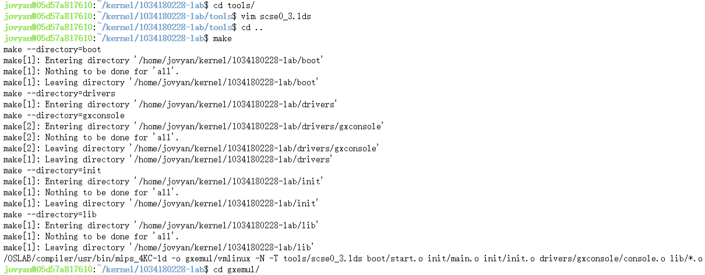


- **查看各个`section`的地址**


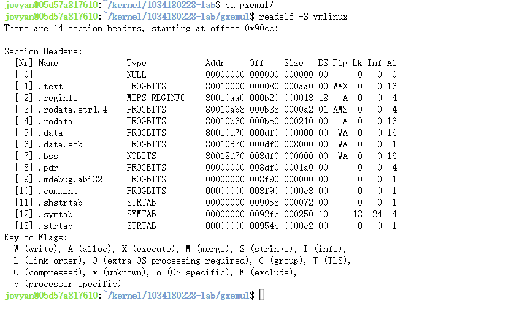


## Exercise 1.4


### 补全 `boot/start.S`

- **栈指针地址应设为 `0x80400000`**

```asm
/*To do: 
  set up stack 
  you can reference the memory layout in the include/mmu.h
*/
li sp, 0x80400000 // 设置栈指针
jal main // 跳转到main函数
nop
```


### 运行 `vmlinux` 文件

- **重新`make`**

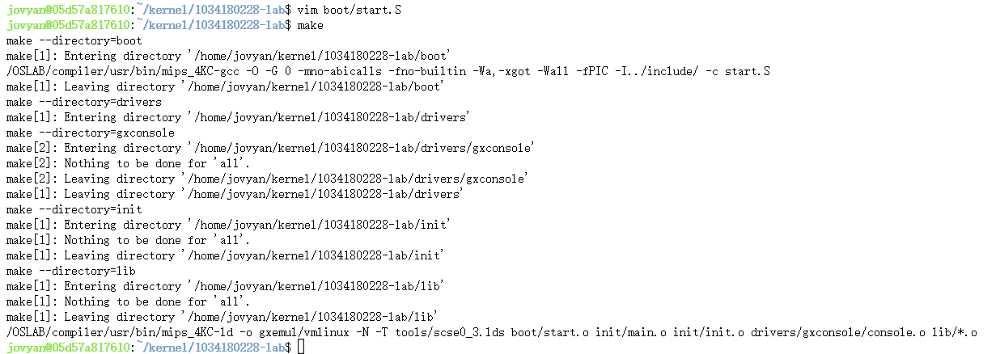

- **执行命令 `gxemul -E testmips -C R3000 -M 64 elf-file`**

`elf-file`为编译生成的`vmlinux`文件的路径

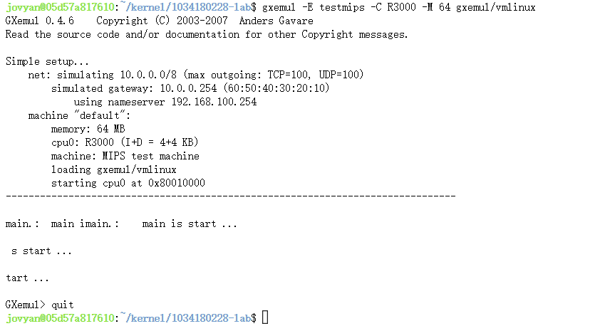


## Exercise 1.5


###  补全 `lp_Print()` 函数

- **找到 `%`**

```c
/* scan for the next '%' */
while((*fmt) != '\0' && (*fmt) != '%') {
    OUTPUT(arg, fmt, 1);//其他字符，直接输出
    fmt ++ ;
}  
/* flush the string found so far */

/* are we hitting the end? */
if((*fmt) == '\0' ) break; //结束了
```


- **取出参数**

```c
/*init the variable */
longFlag = 0;
negFlag = 0;
width = 0;
ladjust = 0;//默认右对齐
prec = 0;
padc = ' ';

/* we found a '%' */
fmt ++ ;

/* check for other prefixes */

/*check for flag */
if(*fmt == '-') ladjust = 1, fmt ++;
else if(*fmt == '0') padc = '0' , fmt ++;

/*check for width */
for(; IsDigit(*fmt); fmt ++ ) width = width * 10 + Ctod(*fmt) ;

/*check for precision */
if(*fmt == '.') 
{
    fmt ++ ;
    for(; IsDigit(*fmt); fmt ++ ) 
        prec = prec * 10 + Ctod(*fmt) ;
}

/* check for long */
if( *fmt == 'l' ) {
    longFlag = 1;
    fmt ++ ;
} 
```

### 输出结果

- **重新`make`**

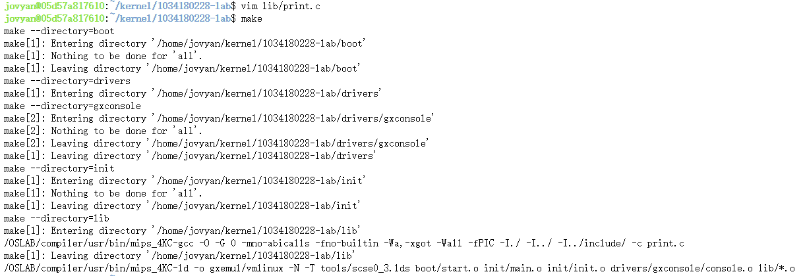


- 执行命令 `gxemul -E testmips -C R3000 -M 64 elf-file` , 查看输出结果

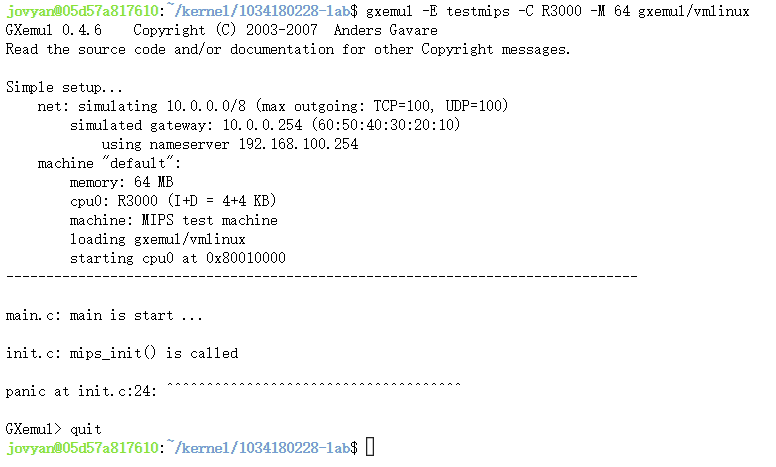


### push到远程进行测试

- **`git push`**

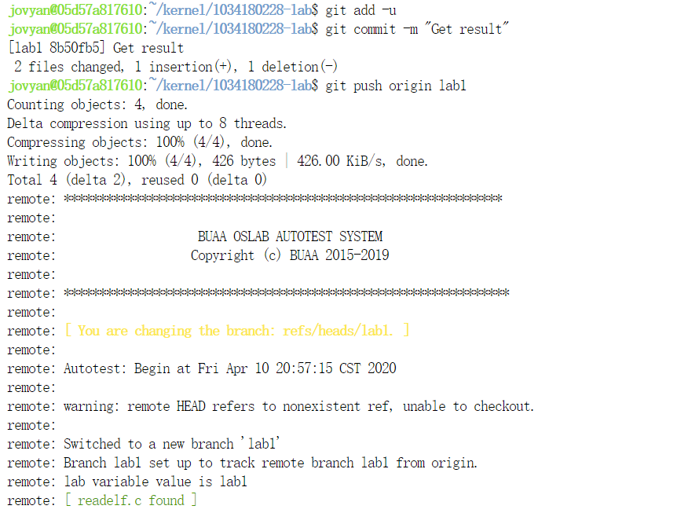


- **结果**

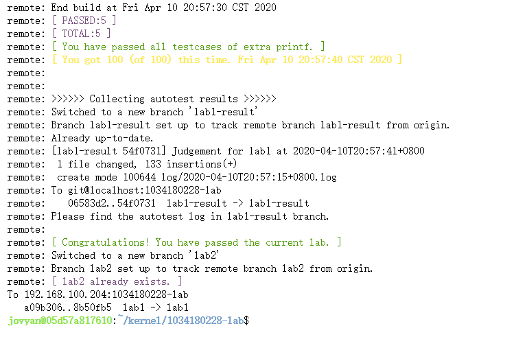-


## 奇怪的地方

刚开始我使用的实验指导书版本比较就。老师后来又发了一个最新版本的实验指导书。我开始做实验用的都是旧版本指导书里的交叉编译路径 `/opt/eldk/usr/bin/mips_4KC-` ,  在本地能正常的生成`vmlinux` 文件,没有报任何错误。但是当我`git push`到远程仓库时，测试结果显示报错了，显示交叉编译路径不对。

后来我把交叉编译路径改为新版本指导书里的交叉编译路径`/OSLAB/compiler/usr/bin/mips_4KC-`就能通过了，为什么老版本书籍里的路径在本地不会报错，远程就会报错呢？